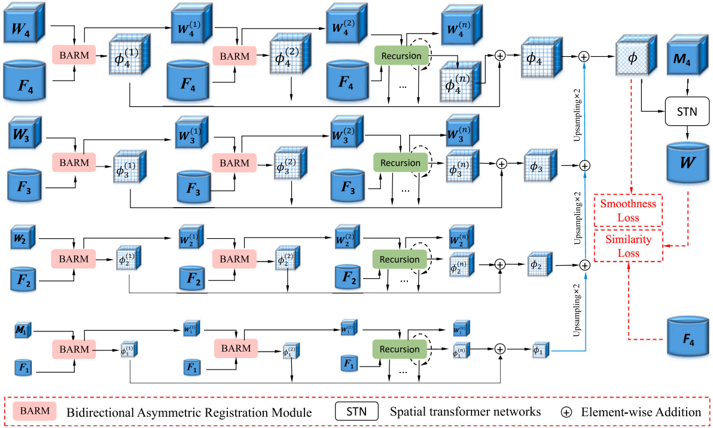

# Hierarchical cumulative network for unsupervised medical image registration

[NEWS!!]**The [pytorch](https://github.com/maxxk0425/max/tree/main) version is opened now!**

We propose a novel hierarchical cumulative network (HCN), which explicitly considers the optimal similarity position with an effective Bidirectional Asymmetric Registration Module (BARM). The BARM simultaneously learns two asymmetric displacement vector fields (DVFs) to optimally warp both moving images and fixed images to their optimal similar shape along the geodesic path. Furthermore, we incorporate the BARM into a Laplacian pyramid network with hierarchical recursion, in which the moving image at the lowest level of the pyramid is warped successively for aligning to the fixed image at the lowest level of the pyramid to capture multiple DVFs. We then accumulate these DVFs and up-sample them to warp the moving images at higher levels of the pyramid to align to the fixed image of the top level. The entire system is end-to-end and jointly trained in an unsupervised manner. Extensive experiments were conducted on two public 3D Brain MRI datasets to demonstrate that our HCN outperforms both the traditional and state-of-the-art registration methods. To further evaluate the performance of our HCN, we tested it on the validation set of the MICCAI Learn2Reg 2021 challenge. Additionally, a cross-dataset evaluation was conducted to assess the generalization of our HCN. Experimental results showed that our HCN is an effective deformable registration method and achieves excellent generalization performance.

<p align="center"></p>

## Paper
This repository provides the official pytorch implementation of HCN in the following papers:

**Hierarchical cumulative network for unsupervised medical image registration** <br/> 
[Xinke Ma](https://scholar.google.com.hk/citations?user=RT_DBEUAAAAJ&hl=zh-CN&oi=sra), [Yong Xia*](https://scholar.google.com.hk/citations?user=Usw1jeMAAAAJ&hl=zh-CN), Jiang He, Xing Liu, Qin Liu, Geng Chen,  Bo Yuan, Changyang Li. <br/>
Northwestern Polytechnical University <br/>
Computers in Biology and Medicine ([CIBM](www.elsevier.com/locate/compbiomed)) <br/>
[Paper](https://doi.org/10.1016/j.compbiomed.2023.107598) | [Code](https://github.com/maxxk0425/max/tree/main)

## Available implementation
- [pytorch/](https://github.com/maxxk0425/max/tree/main)

## Citation
If you use HCN for your research, please cite our papers:
```
@article{ma2023hierarchical,
  title={Hierarchical cumulative network for unsupervised medical image registration},
  author={Ma, Xinke and He, Jiang and Liu, Xing and Liu, Qin and Chen, Geng and Yuan, Bo and Li, Changyang and Xia, Yong},
  journal={Computers in Biology and Medicine},
  pages={107598},
  year={2023},
  publisher={Elsevier},
  doi={10.1016/j.compbiomed.2023.107598}
}

```

## Acknowledgments

This This work was supported in part by the Key Research and Development Program of Shaanxi Province 2022GY-084, in part by the National Key R&D Program of China under Grant 2022YFC2009903 and 2022YFC2009900, and in part by the National Natural Science Foundation of China under Grant 62171377.

